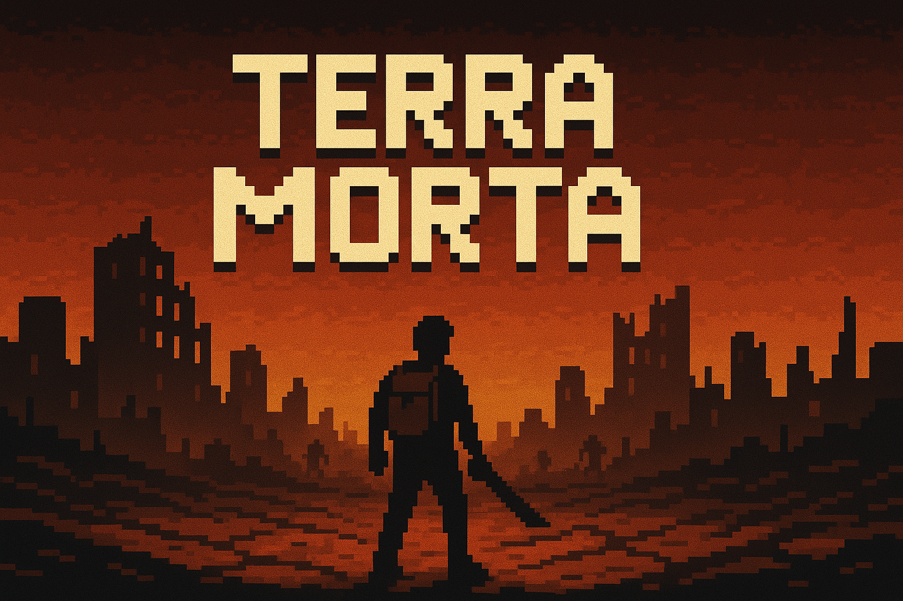

# 🌍 Terra Morta

**Terra Morta** é um projeto de **RPG pós-apocalíptico** inspirado principalmente no universo da franquia **Fallout**. O jogo apresenta um mundo devastado, onde a civilização entrou em colapso após uma guerra nuclear e os poucos sobreviventes lutam para permanecer vivos.

---

## 🧠 Ideia do Projeto

Em **Terra Morta**, você controla um sobrevivente que tenta reconstruir sua vida em um ambiente inóspito e hostil. A proposta é oferecer uma experiência envolvente de RPG, com foco em:

- **Exploração** de áreas destruídas e contaminadas.
- **Combate** contra inimigos mutantes, saqueadores, cães famintos e outras criaturas deformadas pela radiação.
- **Gestão de recursos**, como água potável, comida, munição e peças para conserto de equipamentos.
- **Evolução do personagem**, com desenvolvimento de habilidades, criação de armas e equipamentos.
- **Construção e melhoria da sua base**, garantindo proteção contra ameaças externas e tornando-a um refúgio seguro.

---

## 🗺️ O Mundo

O planeta foi arrasado. Cidades viraram ruínas, os oceanos secaram em muitas regiões e a radiação alterou a fauna, a flora e os seres humanos. A vida agora se resume à luta por água limpa, abrigo e comida.

Você começa com quase nada. Precisa procurar recursos, enfrentar perigos e tomar decisões difíceis. Sobreviver significa ser esperto, brutal e implacável.

---

## ⚔️ Inimigos

O mundo de **Terra Morta** é recheado de ameaças, como:

- **Cães famintos e mutantes**
- **Baratas radioativas gigantes**
- **Sobreviventes hostis**
- **Pessoas deformadas pela radiação**
- **Facções organizadas com objetivos próprios (aliadas ou inimigas)**

---

## 🔧 Status

    

---

## Membros da Equipe 👥

|  |  |  |  |
|:-:|:-:|:-:|:-:|
| [Enzo Emir](https://github.com/EnzoEmir) | [Victor Pontual](https://github.com/VictorPontual) | [Vitor Ricardo](https://github.com/Vitor-Ricardo-MS) | [Isaac Menezes](https://github.com/IsaacMPereira) |

 

---
